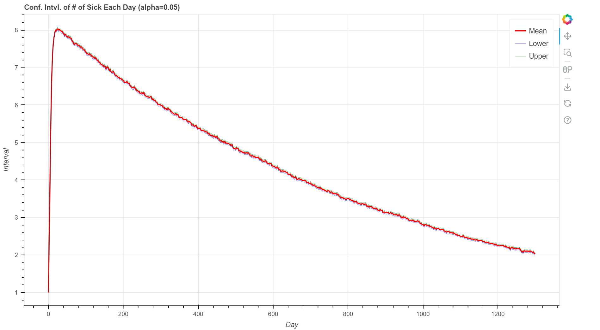

# flusim

## Overview

This repository holds the files for the `flu-sim` Python package. This is a package used for simulating, calculating and visualizing some statistics related to a simple flu-spread problem.

For example, one can visualize a single flu spread:


or simulate a flu spread multiple times and plot the computed confidence intervals:



To use this package, run

```bash
pip install flusim
```

To customize upon this package, clone this repository, and run `pip install .` to initialize.

## Usage

For usage, please refer to this [link](https://github.com/ZebraAlgebra/flusim/blob/main/app/README.md).

## Problem Definition

The **flu-spread problem** is defined as follows.
Suppose inside a closed environment, there are:

1. `n + 1` people in it, labeled `0, 1, ..., n`
2. no people sick before day `0`, and `k` people
   sick at day `1`
3. on each day, a sick person has a probability `p`
   contaminating a healthy person
4. these events are independent
5. each person once get sick, will get healthy after
   precisely `l` days

then the problem is to calculate the expectation, variance of:

1. the end date of flu
2. the number of sick people in each day

This problem can be formulated as a Markov process, and simulations, solvers can be designed to solve this question.
